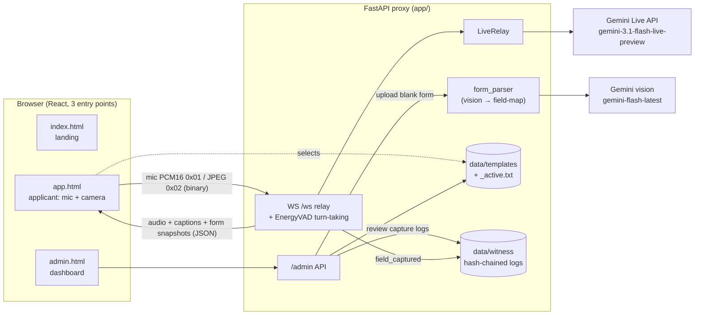
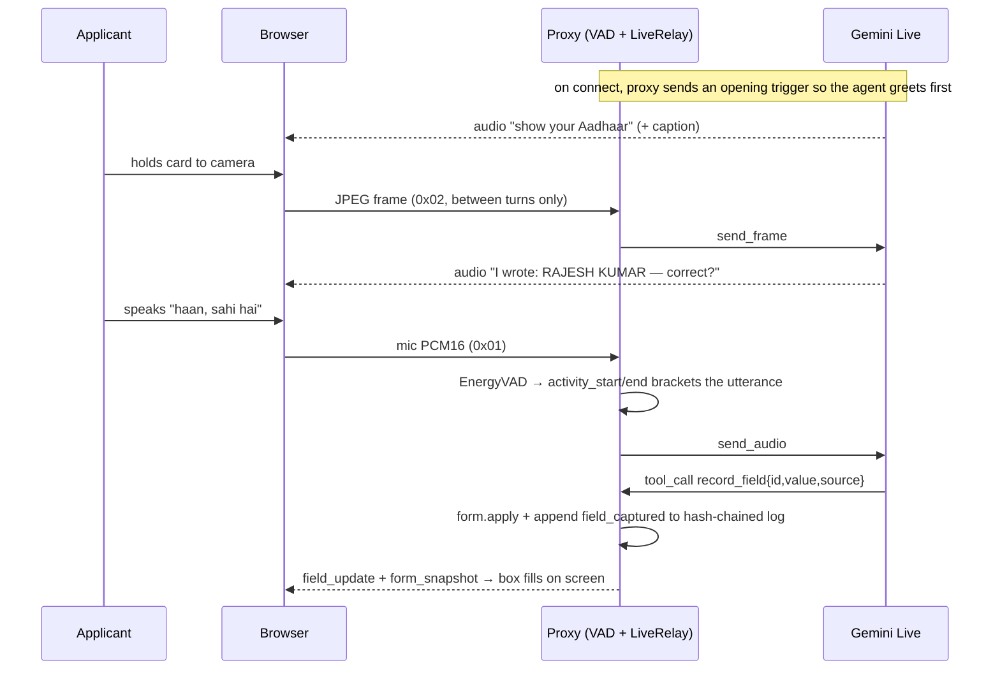

# Sahayak-AI

**An Indian-native, voice-first agentic layer for official paperwork.** A person who
can't read or write completes a real government/finance form by *speaking* and *showing
their documents* to a camera — and watches it fill itself. Built for the Google DeepMind
Bangalore Hackathon (PS1 — Live API / Live Translate).

Sahayak is not a chatbot that answers questions. It **completes a task**. An agent built
on the Gemini Live API:

- **Perceives** — reads your Aadhaar / PAN through the camera *and* hears your voice.
- **Acts** — writes structured form fields via tool-calls, live on screen.
- **Adapts** — follows you across six Indian languages mid-conversation, no toggle.
- **Confirms** — reads every value back in your language before committing it, so a
  misread is caught by *you*, not discovered at rejection.
- **Generalizes** — an admin uploads *any* blank form; Gemini vision parses it into a
  field-map; anyone can then fill it by talking. Forms are the "apps".

Design thesis: **perception is probabilistic; the record is deterministic.** The Live
session sees / hears / speaks; the proxy owns an append-only, hash-chained **capture log**
recording every confirmed value with its source (`document` | `voice`).

Languages today: Hindi, Tamil, Telugu, Bengali, Marathi, Kannada (`hi ta te bn mr kn`).

## The loop

1. Agent greets in the applicant's language and asks for the first field.
2. Per template field: **document** field → agent asks for the card, reads it via camera;
   **voice** field → agent asks, applicant speaks.
3. Agent confirms the value back by voice (`"நான் எழுதியது: … — சரியா?"`); applicant
   approves → the field fills on screen.
4. All fields confirmed → the completed form renders clean and printable.

## Architecture

Three tiers, two planes (applicant + admin), file-backed state — no database.



**Capture loop (one field):**



- **Capture is via Live tool-calling** (`record_field`, `form_complete` function
  declarations) — structured and language-agnostic. A `[[FIELD:id=value]]` marker parser
  (`app/markers.py`) is a fallback and also scrubs stray markers from captions.
- **Turn-taking:** Gemini's automatic VAD is OFF (it doesn't segment this streamed audio).
  The proxy runs an energy VAD (`app/vad.py`, RMS threshold + trailing silence) and brackets
  each utterance with `activity_start` / `activity_end`. Camera frames are sent only *between*
  turns — realtime video during a speech window is rejected by the Live API (1007).
- **Capture log** = per-session append-only, hash-chained JSONL (`app/witness_log.py`);
  each confirmed field is a `field_captured` entry `{field, value, source}`.
- **Multi-form** (`app/template_store.py`): file-backed template store with an active
  pointer; seeds the demo form (`jkp_pension_2a`, 3 fields) on first run.

### File map

```
app/
  main.py            FastAPI: landing, /template(s), WS /ws relay, mounts admin + static
  live_session.py    LiveRelay over the Gemini Live session (send audio/frame/text,
                     activity_start/end, receive_loop; injectable for tests)
  session_config.py  demo TEMPLATE, system instruction, record_field/form_complete
                     tools, LIVE_MODEL, live_config(template, lang)
  vad.py             EnergyVAD (RMS start / silence-ms end) + chunk_ms
  session.py         Session + registry, per-session template/lang, single-writer queue
  form_state.py      the live-filling form (per-field value/status/source)
  form_parser.py     upload a blank form → field-map draft via Gemini vision
  template_store.py  file-backed multi-template store + active pointer (seeds demo)
  markers.py         [[FIELD]]/[[FORM_COMPLETE]] fallback parser + caption scrub
  witness_log.py     append-only, hash-chained capture log
  admin.py           admin API: template CRUD, parse-form, session/log review
  protocol.py        binary media in / JSON events out
frontend/
  index.html / app.html / admin.html   landing · applicant app · admin dashboard
  src/App.tsx          applicant layout, event reducer, language badge, captions
  src/SessionView.tsx  camera preview + captions + the filling form
  src/useMedia.ts      mic/camera capture + agent-audio playback (venue-verified)
  src/useWebSocket.ts  typed event stream + binary send
  src/Form.tsx         the form that fills itself live + printable finale
  src/i18n.ts          six-language UI strings
  src/admin/           admin dashboard components
scripts/smoke_live.py  headless connect + one text turn (no audio)
```

## API

| Method | Path | Purpose |
|--------|------|---------|
| GET | `/health` | liveness + active session count + model |
| GET | `/templates` | list forms the applicant panel offers |
| GET | `/template[?id=<tid>]` | active form (or a specific one) as a field-map |
| WS  | `/ws?template=<tid>&lang=<code>` | the live relay (defaults: active form, `hi`) |
| GET/POST/PUT/DELETE | `/admin/templates[/{tid}]` | template CRUD |
| POST | `/admin/templates/{tid}/activate` | set the applicant-facing form |
| POST | `/admin/parse-form` | upload a blank form → draft field-map (Gemini vision) |
| GET | `/admin/sessions[/{sid}]` | list capture logs / read one + verify its hash chain |

> The admin plane has **no auth** (localhost demo, stated limitation) — it exposes template
> editing and applicants' capture logs (names / ID values). Do not expose this port on a
> shared network.

## Run

```bash
python3 -m venv .venv && . .venv/bin/activate
pip install -r requirements.txt
export GOOGLE_API_KEY=...                 # required for the Live session + form parsing
cd frontend && npm install && npm run build && cd ..
uvicorn app.main:app --port 8000          # open http://localhost:8000
```

Dev (frontend proxies `/ws`, `/health`, `/template*`, `/admin` to `:8000`):

```bash
cd frontend && npm run dev
```

Reloading backend: `uvicorn app.main:app --reload --reload-dir app` keeps the reloader off
the `data/` tree so a log or template write never drops a live session.

### Config (env)

| Var | Default | What |
|-----|---------|------|
| `GOOGLE_API_KEY` | — | required |
| `SAHAYAK_LIVE_MODEL` | `gemini-3.1-flash-live-preview` | the Live model |
| `SAHAYAK_PARSE_MODEL` | `gemini-flash-latest` | vision model for form parsing |
| `SAHAYAK_TEMPLATE_DIR` | `./data/templates` | template store |
| `SAHAYAK_LOG_DIR` | `./data/witness` | capture logs |
| `SAHAYAK_VAD_START_RMS` / `SAHAYAK_VAD_SILENCE_MS` | `700` / `800` | turn-taking sensitivity |

## Test

```bash
. .venv/bin/activate && pytest    # markers, form_state, live_relay (mock), witness_log,
                                  # ws, template_store, form_parser, admin_api, vad, env
cd frontend && npm test           # Form, useWebSocket, reducer
python scripts/smoke_live.py      # headless Live connect + one text turn (needs GOOGLE_API_KEY)
```

The mic/camera/audio path (`useMedia.ts`) needs real hardware and is verified at the venue,
not in CI. The Live relay is tested against a scripted mock session (`tests/mocks.py`) with
zero network.

## Honest boundaries

- For a fully illiterate user there is still a human submit/thumbprint step — Sahayak makes
  the **capture** accurate, in-language, and confirmed by the applicant, not the submission.
- Session content is ephemeral; the capture log stays local.
- The capture log is tamper-evident against edits and mid-file deletions, **not** against a
  clean truncation of the tail (that needs external anchoring — out of scope).
- Uploaded-form parsing produces a *draft* field-map the admin reviews before it goes live;
  it is never auto-saved. Printed official documents read far more reliably than handwriting.
- The admin plane is unauthenticated by design for the demo (see API note).
